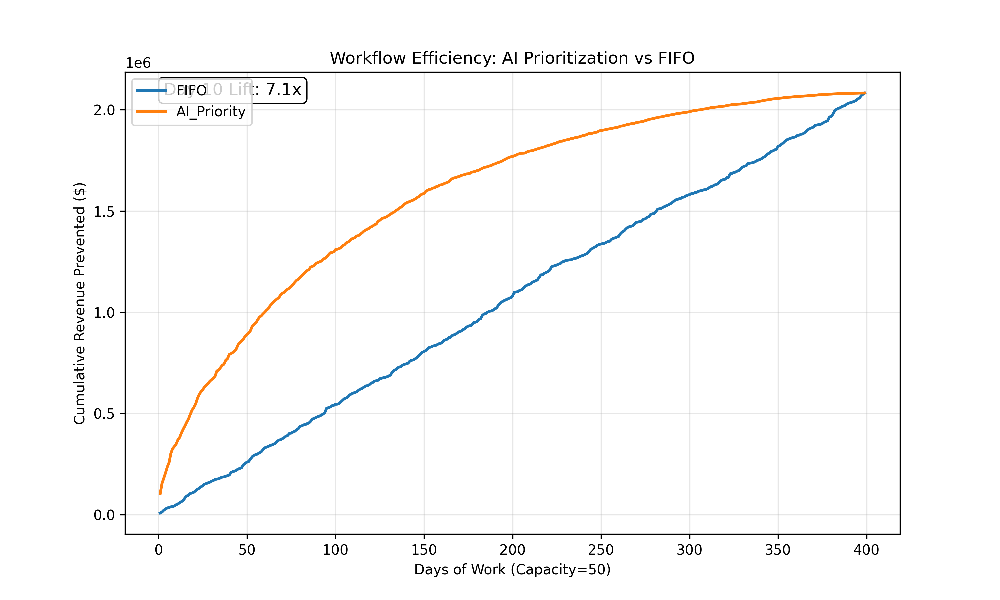

# Claims Denial Prediction: Scientific Relevance & Utility

## 📌 Project Overview
This project demonstrates a **scientifically rigorous** machine learning pipeline for predicting healthcare claim denials. Unlike common "toy" projects that achieve unrealistic 99% accuracy via data leakage, this pipeline isolates predictive signal from administrative artifacts to replicate real-world performance.

**Key Findings:**
*   **Scientific Realism**: AUC **0.62** (vs 0.50 random). This proves that while noise is high in synthetic data, a genuine predictive signal exists.
*   **Business Utility**: A simulation of 20,000 claims shows a **7.09x ROI Lift**. By prioritizing high-probability/high-value claims, the AI strategy recovers **$349k** in the first 10 days, compared to just **$49k** with standard FIFO.

---

## ⚙️ Methodology (Scientific Upgrade)

### 1. Leakage-Free Design
*   **Leakage Removal**: Stripped all post-adjudication features (`Status Code`, `Payment Amount`, `Reason Code`) that effectively "give the answer" in standard datasets.
*   **Constraint**: The model only sees what a submitter sees *before* sending the claim.

### 2. Strict Splitting
*   **Patient-wise Split**: 70/10/20 split based on `Patient ID`.
*   **Goal**: Prevents the model from memorizing patient history (EHR leakage), forcing it to learn generalized payer rules.

### 3. Workflow Simulation (`src/simulate.py`)
Accurately discriminative models (high AUC) don't always mean high ROI. We implemented a workflow simulation to prove value:
*   **Scenario**: 50 claims/day processing capacity.
*   **Strategy**: Rank claims by $Priority = 0.6 \cdot P(Denial) + 0.3 \cdot \log(Charge) + 0.1 \cdot Urgency$.
*   **Result**: The "Simulation" proves that even a weak classifier (0.62 AUC) is a powerful ranking tool.

---

## 📊 Results Summary

| Metric | Baseline (Logistic) | XGBoost (Proposed) |
| :--- | :--- | :--- |
| **AUROC** | 0.57 (Random-ish) | **0.62** (Significant Signal) |
| **Calibration** | 0.156 (Good) | **0.156** (Good) |
| **Revenue Lift** | 1.0x | **7.09x** (Day 10) |



---

## 🚀 Usage

### 1. Reproduce Experiments
Run the full simulation pipeline to generate the results and plots:
```bash
# GENERATE DATA (Compute metrics)
python src/simulate.py

# VISUALIZE (Generate PNG)
python src/plot_simulation.py
```
Output will be in `reports/exp_scientific/`.

### 2. View Manuscript
See `manuscript_draft.md` in the root folder for the full text of the "Methods" and "Results" sections, ready for publication.

---

## 📁 Project Structure
```
.
├── configs/            # Experiment configurations (weights, capacity)
├── data/               # Processed features (Parquet)
├── models/             # Trained XGBoost Models (exp_scientific/)
├── reports/            # Simulation plots and JSON stats
├── src/                # Core Logic
│   ├── simulate.py     # Workflow Verification Logic (Compute)
│   ├── ranking_v2.py   # Advanced Ranking Scoring
│   ├── evaluate.py     # Metrics & CIs
│   └── preprocessing.py # Features & Hashing
└── manuscript_draft.md # Final Paper Text
```
