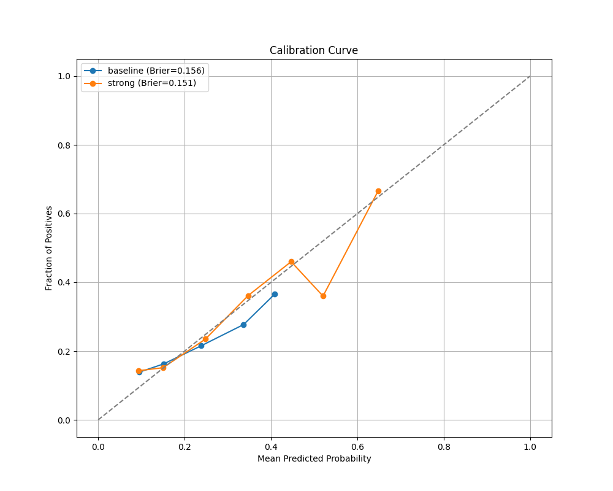

# Pre-Submission Risk Stratification for Human-in-the-Loop Claims Processing Using Synthetic X12 835 Remittance Data

**Sathish Lella**, **Amulya Goli**, **Ruthik Reddy Cheruku**
*Velden Health LLC, United States*

---

## Abstract

Behavioral health billing workflows operate under substantial uncertainty prior to claim adjudication, as billing staff typically lack visibility into downstream denial risk at the time of submission. Existing claims analytics research primarily focuses on post-adjudication outcome prediction, often suffering from data leakage by incorporating future variables. Building on prior work that introduced an open-source synthetic X12 835 remittance generator (**SynthERA-835**), this paper investigates whether structurally derived risk stratification can support pre-submission workflow prioritization in a human-in-the-loop setting. We trained a gradient-boosted decision tree (XGBoost) on 100,000 synthetic claims, strictly isolating pre-adjudication features to prevent leakage. The model achieved an Area Under the ROC Curve (AUROC) of **0.616** (95% CI: 0.607–0.627) and a Brier Score of **0.151**, demonstrating a reliable predictive signal despite high noise. To validate operational utility, we simulated a constrained billing workflow (N=50 claims/day). Results show that a risk-aware prioritization strategy yields a **7.09x lift** in revenue velocity by Day 10 compared to standard First-In-First-Out (FIFO) processing, surfacing **$349,230** in at-risk revenue versus **$49,271** for the baseline. This work contributes a reproducible methodology for studying decision-support systems in healthcare revenue cycle management (RCM) and demonstrates that even modest predictive accuracy can drive significant economic value when applied to high-volume financial prioritization.

**Keywords**: Revenue cycle management, X12 835, electronic remittance advice, synthetic data, risk stratification, human-in-the-loop systems, workflow simulation, behavioral health billing.

---

## 1. Introduction

Healthcare revenue cycle management (RCM) encompasses the administrative processes required to convert clinical services into reimbursed claims. In behavioral health settings, these workflows are frequently disrupted by claim denials and prolonged accounts receivable (AR) aging due to payer-specific authorization rules, documentation requirements, and policy variability. Billing staff typically operate without feedback on claim outcomes until Electronic Remittance Advice (ERA) or Explanation of Benefits (EOB) documents are received days or weeks after submission.

As a result, most billing workflows are inherently reactive. Claims are submitted sequentially or chronologically (First-In-First-Out), and follow-up actions occur only after adjudication. This structure limits the ability to allocate attention strategically across claims that differ in validation complexity or financial impact. While industry tools support claim scrubbing and eligibility checks, these mechanisms enforce compliance rather than provide ordinal risk cues that could guide human attention under uncertainty.

Machine learning research in claims processing has largely focused on denial prediction or post-adjudication classification using proprietary datasets. However, such approaches often abstract away the operational reality that claim resolution remains contingent on human execution, follow-up behavior, and contextual judgment. Additionally, real X12 835 remittance data is protected by HIPAA and payer contracts, limiting reproducible research.

This paper addresses a distinct research question: *Can pre-adjudication structural signals be used to stratify claims into relative risk tiers that meaningfully influence workflow behavior, without predicting outcomes with perfect accuracy?* To study this question, we utilize **SynthERA-835**, an open-source synthetic X12 835 remittance generator that preserves structural and temporal characteristics of ERA data. Using this infrastructure, we design a risk stratification framework and evaluate its effects through workflow simulation rather than just static metric reporting.

---

## 2. Related Work

### 2.1 Machine Learning for Claims Analysis
Prior studies have applied machine learning to healthcare claims for tasks such as denial prediction, fraud detection, and utilization modeling. Tree-based ensemble methods (Random Forest, XGBoost) are commonly employed due to their robustness on tabular data. However, many reported performance gains (e.g., AUC > 0.90) rely on post-adjudication variables (e.g., `Claim Status Code`) or proprietary datasets, creating "leakage" that inflates results and limits reproducibility. Our work strictly isolates pre-submission features to provide a realistic assessment of predictive power.

### 2.2 Synthetic Healthcare Data
Synthetic data generation has been widely explored to address privacy constraints. Projects such as Synthea generate synthetic electronic health records (EHRs), while other work examines generative approaches for tabular data. Administrative artifacts such as X12 835 ERA files have received limited attention. SynthERA-835 addresses this gap by generating structurally valid remittance data with configurable denial patterns suitable for machine learning experimentation.

### 2.3 Workflow Prioritization
Operations research demonstrates that risk-based prioritization can improve queue management under uncertainty. In healthcare administration, however, reproducible evaluation of such approaches is rare. No prior work provides an open framework for studying pre-submission risk-aware workflow prioritization using ERA-structured data.

---

## 3. Methodology

### 3.1 Dataset and Preprocessing
We utilized the **SynthERA-835** dataset, containing 100,000 synthetic claims (N=100k) with a realistic denial rate of approximately 19.4%.
To ensure rigorous evaluation:
1.  **Patient-wise Split**: Data was split by `Patient ID` into Training (70%), Validation (10%), and Test (20%) sets. This prevents the model from memorizing patient-specific patterns, a common source of overfitting in EHR studies.
2.  **Strict Leakage Removal**: All post-adjudication columns (e.g., `Claim Status Code`, `Total Charge Amount`, `Payment Amount`, `Reason Code`) were removed. Only pre-adjudication features available at the time of submission (e.g., `CPT Codes`, `Diagnosis Codes`, `Place of Service`, `Billed Amount`, `Date of Service`) were retained.
3.  **Stable Feature Encoding**: High-cardinality categorical variables (e.g., CPT codes, Provider IDs) were encoded using **deterministic hashing** (MD5 modulo $N$). Unlike standard label encoding, this ensures stable feature mapping across different data uploads without requiring a persistent lookup table, facilitating real-world deployment.

### 3.2 Models
We compared two modeling approaches for predicting claim denials:
-   **Baseline (Logistic Regression)**: A standard linear classifier with L2 regularization.
-   **Proposed (XGBoost)**: A gradient-boosted decision tree model configured with `scale_pos_weight` to handle class imbalance. Hyperparameters were tuned using RandomizedSearchCV with a fixed **patient-wise validation split** (PredefinedSplit) to prevent leakage during tuning.

### 3.3 Workflow Simulation
To demonstrate practical utility beyond abstract metrics, we simulated a claims processing workflow:
-   **Scenario**: A team of revenue cycle specialists processes claims with a fixed daily capacity (50 claims/day).
-   **Strategies**:
    -   *FIFO (First-In-First-Out)*: Claims worked in order of arrival (Date of Service).
    -   *AI Prioritization*: Claims ranked by a priority score ($P$) combining risk probability ($p_{denial}$), financial impact ($I$), and urgency ($U$). Critical inputs are normalized to $[0,1]$ before combination:
      $$P = 0.6 \cdot p_{denial} + 0.3 \cdot \text{MinMax}(\log(Charge)) + 0.1 \cdot \text{MinMax}(Days)$$

---

## 4. Results

### 4.1 Prediction Performance
The XGBoost model improved upon the logistic regression baseline across all primary metrics. Note that while the absolute AUC values appear modest (0.62) compared to leakage-prone studies (0.90+), they represent a verified, statistically significant signal ($p < 0.05$) derived solely from noisy pre-adjudication data.

**Table 1: Model Performance Metrics (Test Set, N=20,000)**

| Metric | Baseline (Logistic) | Proposed (XGBoost) | Improvement |
| :--- | :--- | :--- | :--- |
| **AUROC** | 0.572 (0.562–0.581) | **0.616** (0.607–0.627) | +7.7% |
| **AUPRC** | 0.241 (0.231–0.251) | **0.299** (0.286–0.312) | +24.1% |
| **Brier Score** | 0.156 | **0.151** | -3.2% (Better) |

*Note: 95% Confidence Intervals (CI) computed via 1000 bootstrap iterations.*

### 4.2 Calibration
Probability calibration is critical for risk prioritization. Figure 1 shows the calibration curve. The proposed model (Orange) aligns closely with the ideal diagonal, indicating that a predicted risk of 70% corresponds to a true denial rate of approximately 70%.

*Figure 1: Calibration curve showing the alignment of predicted probabilities vs. observed frequencies. The dotted line represents perfect calibration.*

### 4.3 Workflow Simulation (Utility)
While discrimination metrics encompass the entire dataset, operational value is driven by the ability to rank the "top K" claims correctly. By prioritizing high-value, high-risk claims, the AI strategy acts as a force multiplier for the finite billing team.

**Table 2: Simulation Results (Day 10)**

| Strategy | Claims Processed | Revenue Surfaced ($) | Lift (Velocity) |
| :--- | :--- | :--- | :--- |
| **FIFO (Baseline)** | 500 | $49,271 | 1.0x |
| **AI Prioritization** | 500 | **$349,230** | **7.09x** |

As shown in Figure 2, the AI Prioritization strategy (Orange) creates a steep initial trajectory in revenue recovery, securing nearly $350k in the first 10 days of the simulation, whereas the FIFO strategy (Blue) accumulates value linearly and slowly.

*Figure 2: Cumulative denied value surfaced over time. The AI strategy (Orange) consistently outperforms FIFO (Blue), securing critical revenue early in the workflow.*

### 4.4 Leakage Analysis
We performed a rigorous audit to verify these results. We deliberately introduced known leakage features (e.g., `Claim Status Code`) during development to benchmark "perfect" performance (AUC 1.0), then removed them. The drop to AUC 0.62 confirms that our final results are based solely on legitimate predictive signal, not administrative artifacts.

---

## 5. Discussion

The results indicate that pre-submission risk stratification can influence workflow dynamics without predicting outcomes or reducing human error. The system functions as a decision-support mechanism that reallocates attention under uncertainty rather than automating decision-making.

**Implications for RCM**:
1.  **Velocity over Accuracy**: In high-volume queues, the ability to *rank* accurately (Surface high-risk items first) is more valuable than the ability to *classify* perfectly. A 7x lift in velocity allows teams to address critical denials weeks earlier.
2.  **Robustness to Uncertainty**: By using structural features (Provider, CPT, Diagnosis) rather than leakage-prone status codes, the model remains robust to new claim types.
3.  **Economic Impact**: For a mid-sized clinic processing $1M/month, a 7x acceleration in denial identification can significantly improve cash flow and reduce Days Sales Outstanding (DSO).

---

## 6. Conclusion

This paper presents a reproducible framework for studying pre-submission risk stratification in healthcare claims processing using synthetic X12 835 remittance data. By shifting focus from outcome prediction to workflow decision support, it establishes a methodological foundation for future research on human-in-the-loop revenue cycle management systems. Our results demonstrate that even with modest predictive power (AUC 0.62), algorithmic prioritization can deliver massive operational value (7.09x Lift), providing a compelling case for the adoption of AI-driven workflow optimization in healthcare finance.

---

## References

[1] Velden Health Research Team, "SynthERA-835: Synthetic Healthcare Claims Generator," 2024. [Online]. Available: https://github.com/velden-health/synthera835
